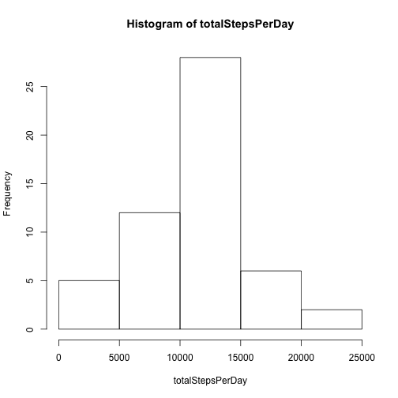
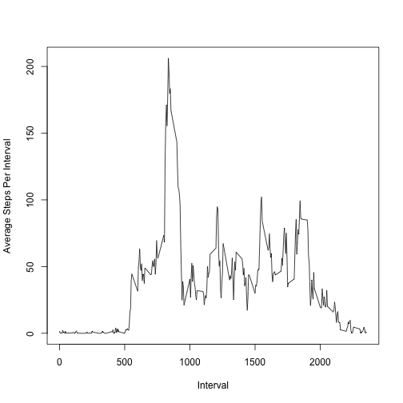
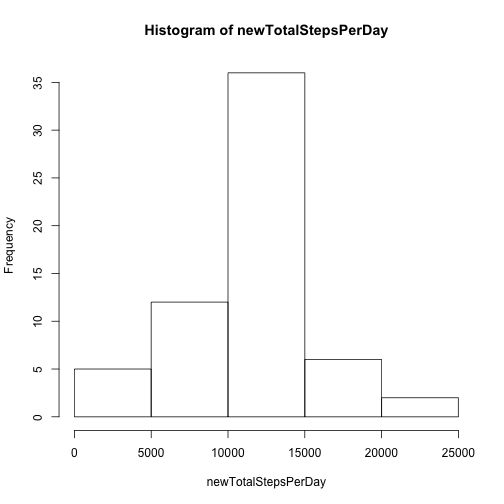

---
output:
  html_document:
    keep_md: yes
---
Reproducible Research - Peer Assignment 1
=========================================

This assignment makes use of data from a personal activity monitoring device.This device collects data at 5 minute intervals through out the day. The data consists of two months of data from an anonymous individual collected during the months of October and November, 2012 and include the number of steps taken in 5 minute intervals each day.

##Loading the data .... 


```r
activityData <- read.csv("activity.csv", header = T)
```

##What is mean total number of steps taken per day?

###1. The total number of steps taken per day


```r
totalStepsPerDay <- tapply(activityData$steps, activityData$date, sum)
```

###2. Histogram of the total number of steps taken each day


```r
hist(totalStepsPerDay)
```

 

###3. The mean and median of the total number of steps taken per day

**Mean** 

```r
mean(totalStepsPerDay, na.rm = T)
```

```
## [1] 10766.19
```
**Median**

```r
median(totalStepsPerDay, na.rm = T)
```

```
## [1] 10765
```

##What is the average daily activity pattern?

###1. Time series plot of the 5-minute interval (x-axis) and the average number of steps taken, averaged across all days (y-axis)
   

```r
# Preparing the data for plotting the time series
averageStepsPerInterval <- as.data.frame.array(tapply(activityData$steps, activityData$interval, mean,
                                                      na.rm = T))
colnames(averageStepsPerInterval) <- c("Average")
averageStepsPerInterval$Interval <- row.names(averageStepsPerInterval)

## Plotting the the time series
plot(averageStepsPerInterval$Interval, averageStepsPerInterval$Average, type = "l", xlab = "Interval", ylab = "Average Steps Per Interval")
```

 

###2. 5-minute interval, on average across all the days, that contains the maximum number of steps


```r
averageStepsPerInterval$Interval[averageStepsPerInterval$Average == 
                                     max(averageStepsPerInterval$Average)]
```

```
## [1] "835"
```

##Imputing missing values

###1. The total number of missing values in the dataset (i.e. the total number of rows with NAs)


```r
sum(is.na(activityData$steps))
```

```
## [1] 2304
```

###2. The strategy chosen for filling in the missing data is very basic. All of the missing values in the dataset are replaced with the mean for that 5-minute interval for each day. In order to achieve this strategy:
 - First, the original data is aggregated by interval and the steps mean are computed based on the aggregate (by interval)
 - Second, the data in the first step above is merged with the orginal data.
 - Third, in the merged data locate all missing values in the steps and fill with computed mean (from step one)
 - Finally, drop the newly added column from the merging (i.e. the means) since they are not needed


```r
# Four steps process as described above
# Step 1:
activityGroupedByInterval <- aggregate(activityData$steps, by = list(interval = activityData$interval),
                                       mean, na.rm = T)
#Step 2:
mergedData <- merge(activityData, activityGroupedByInterval, all.x = T)
#Step 3:
mergedData$steps[is.na(mergedData$steps)] <- mergedData$x[is.na(mergedData$steps)]
# Step 4:
mergedData$x <- NULL
```

###3. New dataset that is equal to the original dataset but with the missing data filled in.

```r
newActivityData <- mergedData[, c("steps", "date", "interval")]
newActivityData <- newActivityData[order(newActivityData$date, decreasing = F),]
```

###4. Histogram of the total number of steps taken each day and the mean and median total number of steps taken per day. Do these values differ from the estimates from the first part of the assignment? What is the impact of imputing missing data on the estimates of the total daily number of steps?

####4.1. Histogram of the total number of steps taken each day.


```r
newTotalStepsPerDay <- tapply(newActivityData$steps, newActivityData$date, sum)
hist(newTotalStepsPerDay)
```

 

####4.2. The mean and median of the total number of steps taken per day

**New Mean** 

```r
mean(newTotalStepsPerDay)
```

```
## [1] 10766.19
```
**New Median**

```r
median(newTotalStepsPerDay)
```

```
## [1] 10766.19
```

##Are there differences in activity patterns between weekdays and weekends?

###1. A new factor variable in the dataset with two levels – “weekday” and “weekend” indicating whether a given date is a weekday or weekend day.


```r
library(lubridate)
library(dplyr)
```

```
## 
## Attaching package: 'dplyr'
## 
## The following objects are masked from 'package:lubridate':
## 
##     intersect, setdiff, union
## 
## The following object is masked from 'package:stats':
## 
##     filter
## 
## The following objects are masked from 'package:base':
## 
##     intersect, setdiff, setequal, union
```

```r
# Create a new factor variable, date, and add it to the data as a new column
newActivityData <- mutate(newActivityData, day = ifelse(wday(date) %in% c(1,7),"weekend","weekday"))
# newActivityData$day <- as.factor(ifelse(weekdays(newActivityData$date) == "Saturday" | 
#                                         weekdays(newActivityData$date) == "Sunday",
#                                         "weekend", "weekday"))
```

###2. A panel plot containing a time series plot (i.e. type = "l") of the 5-minute interval (x-axis) and the average number of steps taken, averaged across all weekday days or weekend days (y-axis). 


```r
library(lattice)
averageStepsNewData <- newActivityData %>% 
    group_by(day,interval) %>%
    summarise(averageSteps = mean(steps))

xyplot(averageSteps ~ interval | day, averageStepsNewData, type = "l", layout = c(1, 2), 
       xlab = "Interval", ylab = "Number of steps")
```

 
